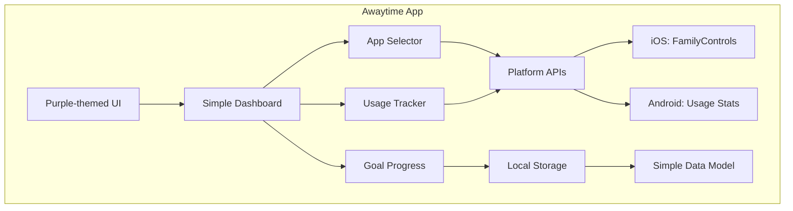
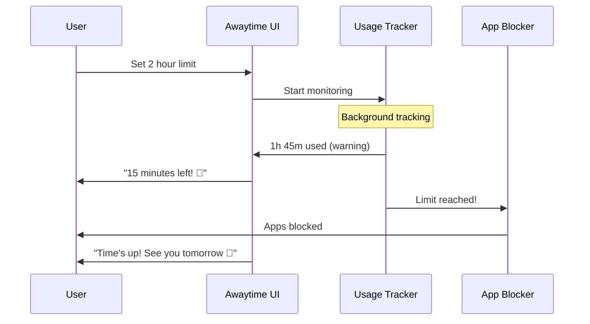

# Design Document

## Overview

Awaytime is a simple, elegant cross-platform mobile application that helps users reduce screen time through intuitive app blocking and progress tracking. The app features a clean interface with purple accent colors and focuses on essential functionality without overwhelming complexity.

The design philosophy emphasizes simplicity, immediate value, and user-friendly interactions. The app uses a straightforward freemium model with core blocking functionality available for free and premium analytics behind a subscription.

## Architecture

### Simplified Architecture



### Platform-Specific Implementations

#### iOS Implementation (Awaytime)
- **UI Framework**: SwiftUI with purple accent colors (#8B5CF6)
- **Data Persistence**: Simple Core Data model
- **Screen Time APIs**: FamilyControls, DeviceActivity, ManagedSettings
- **Notifications**: Basic UserNotifications
- **Monetization**: Simple StoreKit integration

#### Android Implementation (Awaytime)
- **UI Framework**: Jetpack Compose with Material 3 purple theme
- **Data Persistence**: Room database (local only)
- **Usage Tracking**: UsageStatsManager API
- **App Blocking**: AccessibilityService
- **Notifications**: Standard NotificationManager
- **Monetization**: Google Play Billing

## Components and Interfaces

### Core Services (Simplified)

#### 1. Simple Usage Tracking

**iOS (Awaytime):**
```swift
class AwayTimeTracker {
    func requestPermissions() async -> Bool
    func startTracking(apps: [String])
    func getTodayUsage() -> Int // minutes
    func isLimitReached() -> Bool
}
```

**Android (Awaytime):**
```kotlin
class AwayTimeTracker {
    suspend fun requestPermissions(): Boolean
    fun startTracking(packageNames: List<String>)
    fun getTodayUsage(): Int // minutes
    fun isLimitReached(): Boolean
}
```

#### 2. Simple App Blocking

**iOS (Awaytime):**
```swift
class AwayTimeBlocker {
    func blockApps(_ apps: [String])
    func unblockApps()
    func isBlocked() -> Bool
}
```

**Android (Awaytime):**
```kotlin
class AwayTimeBlocker {
    fun blockApps(packageNames: List<String>)
    fun unblockApps()
    fun isBlocked(): Boolean
}
```

#### 3. Simple Notifications

```swift
class AwayTimeNotifications {
    func sendWarning() // "Almost at your limit!"
    func sendBlocked() // "Time's up! See you tomorrow 💜"
    func sendStreak(days: Int) // "🎉 {days} day streak!"
}
```

### Simple Data Models

```swift
// Simple data structure for Awaytime
struct AwayTimeData {
    let selectedApps: [String]
    let dailyLimitMinutes: Int
    let todayUsageMinutes: Int
    let streakDays: Int
    let isBlocked: Bool
    let isPremium: Bool
}

// Daily usage tracking
struct DailyUsage {
    let date: Date
    let minutes: Int
    let limitExceeded: Bool
}
```

### UI Design (Purple Theme)

#### Color Palette
- **Primary Purple**: #8B5CF6 (main accent)
- **Light Purple**: #C4B5FD (backgrounds)
- **Dark Purple**: #5B21B6 (text/icons)
- **Background**: #FAFAFA (light mode), #1A1A1A (dark mode)
- **Success Green**: #10B981 (streaks)
- **Warning Orange**: #F59E0B (limits)

#### Simple Screen Structure

```swift
// iOS SwiftUI Views
struct AwayTimeDashboard: View {
    @StateObject var viewModel = DashboardViewModel()
    
    var body: some View {
        VStack(spacing: 20) {
            // App logo and title
            Text("Awaytime")
                .font(.largeTitle)
                .foregroundColor(.purple)
            
            // Usage progress circle
            ProgressCircle(progress: viewModel.progress)
            
            // Time remaining
            Text("\(viewModel.timeRemaining) left today")
            
            // Simple buttons
            Button("Select Apps") { }
            Button("Set Limit") { }
        }
    }
}
```

## Simple Data Storage

### iOS UserDefaults + Core Data (Minimal)
```swift
// Store simple settings in UserDefaults
struct AwayTimeSettings {
    static let selectedApps = "selectedApps"
    static let dailyLimit = "dailyLimit"
    static let streakCount = "streakCount"
    static let isPremium = "isPremium"
}

// Core Data for usage history only
@Entity
class UsageDay {
    @NSManaged var date: Date
    @NSManaged var minutes: Int32
    @NSManaged var exceeded: Bool
}
```

### Android SharedPreferences + Room (Minimal)
```kotlin
// Simple preferences
class AwayTimePrefs(context: Context) {
    private val prefs = context.getSharedPreferences("awaytime", Context.MODE_PRIVATE)
    
    var selectedApps: Set<String>
        get() = prefs.getStringSet("apps", emptySet()) ?: emptySet()
        set(value) = prefs.edit().putStringSet("apps", value).apply()
    
    var dailyLimit: Int
        get() = prefs.getInt("limit", 120) // default 2 hours
        set(value) = prefs.edit().putInt("limit", value).apply()
}

// Room for usage history
@Entity
data class UsageDay(
    @PrimaryKey val date: String,
    val minutes: Int,
    val exceeded: Boolean
)
```

### Simple Data Flow



## Simple Error Handling

### Common Issues & Solutions

**Permission Denied:**
- Show friendly message: "Awaytime needs permission to help you! 💜"
- Guide to settings with simple steps

**App Blocking Failed:**
- Fallback message: "Please close the apps manually for now"
- Retry blocking in background

**Data Issues:**
- Reset to defaults gracefully
- Keep user informed with simple messages

### User-Friendly Error Messages

```swift
enum AwayTimeMessage {
    case permissionNeeded = "Let's set up Awaytime! We need permission to track your apps 📱"
    case blockingFailed = "Oops! Please close those apps manually for now 💜"
    case dataReset = "Starting fresh! Your settings have been reset ✨"
}
```

## Simple Testing Strategy

### Essential Tests

**Core Functionality:**
- App selection works
- Usage tracking is accurate
- Blocking activates at limit
- Notifications send properly

**User Experience:**
- App launches quickly
- Purple theme displays correctly
- Progress circle updates smoothly
- Settings save properly

**Platform Integration:**
- iOS: FamilyControls permission flow
- Android: Usage Stats access
- Both: Background monitoring works

### Manual Testing Checklist

1. ✅ Install and launch Awaytime
2. ✅ Purple theme displays correctly
3. ✅ Permission request works
4. ✅ Can select apps to monitor
5. ✅ Can set daily limit
6. ✅ Usage tracking updates in real-time
7. ✅ Warning notification at 80%
8. ✅ Apps block at 100% limit
9. ✅ Streak counter increments
10. ✅ Premium paywall shows correctly

This simplified design focuses on core functionality with an elegant purple-themed interface, making Awaytime easy to build and delightful to use.